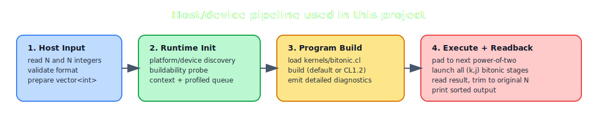
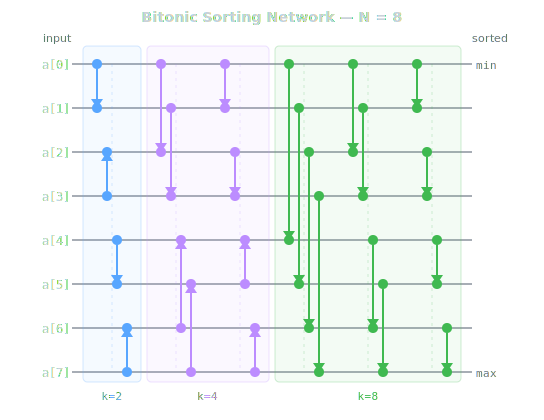
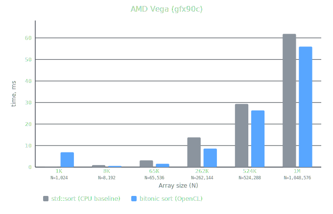
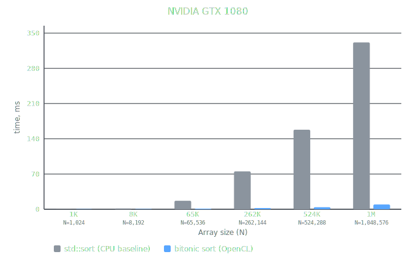

# Bitonic Sort - OpenCL

Integer sorting with the **bitonic sort network** on OpenCL devices (GPU preferred, CPU runtime supported for development/debug).

This repository contains a full host + device pipeline:
- OpenCL platform/device discovery and runtime setup
- Kernel compilation with detailed diagnostics
- Bitonic network execution on device memory
- CLI mode for stdin/stdout sorting
- Unit tests + end-to-end datasets

<p align="center">
    
</p>

---

## Algorithm

Bitonic sort is a **comparison network**: the compare-exchange schedule is data-independent, so each stage can be executed in parallel.

The network illustration below shows `N = 8`:

<p align="center">
    
</p>

Implementation details used in this project:
- Kernel: `bitonic_sort_step_half_ctz`
- Host launches all `(k, j)` stages in sequence (`k = 2, 4, 8, ...`)
- Each stage compares independent pairs and swaps if required
- OpenCL events are collected to measure aggregate kernel time

---

## Input/Output Contract

`bitonic_sort` reads from `stdin` and writes to `stdout`.

Input format:
```text
N
a0 a1 ... a(N-1)
```

Output format:
```text
b0 b1 ... b(N-1)
```

Contract:
- `N` must be a non-negative integer
- values are `int32`
- output is sorted in non-decreasing order
- output length is exactly `N`
- for `N = 0`, output is empty

### Non-power-of-two `N`

Bitonic networks are natural for sizes `2^k`.
This implementation supports arbitrary `N` by:
1. padding to next power of two with `INT_MAX`,
2. sorting on device,
3. trimming back to original length `N`.

---

## Requirements

| Dependency | Version |
|------------|---------|
| CMake      | >= 3.15 |
| C++        | 17      |
| OpenCL     | >= 1.2  |
| GTest      | any     |

Tested on:
- POCL (CPU runtime)
- AMD OpenCL stack (Vega GPU)

> [!NOTE]
> Some OpenCL runtimes report compiler availability but still fail to build kernels (see [Known Runtime Issues](#known-runtime-issues)).

---

## Build

```bash
# release
cmake -S . -B build -DCMAKE_BUILD_TYPE=Release
cmake --build build

# debug + unit tests
cmake -S . -B build -DCMAKE_BUILD_TYPE=Debug -DBUILD_TESTS=ON
cmake --build build

# with sanitizers
cmake -S . -B build -DCMAKE_BUILD_TYPE=Debug -DBUILD_TESTS=ON -DSANITIZE=ON
cmake --build build
```

Binary: `build/bitonic_sort`
Kernel source copied by CMake to: `build/kernels/bitonic.cl`

---

## Usage

### Sort mode

Reads from **stdin**, writes to **stdout**. Diagnostics go to **stderr**.

Example:
```bash
echo "5
3 1 4 1 5" | ./build/bitonic_sort
# stdout: 1 1 3 4 5
```

Override the default kernel path with `--kernel`:
```bash
./build/bitonic_sort --kernel /path/to/bitonic.cl
```

Show CLI help:
```bash
./build/bitonic_sort --help
```

> [!NOTE]
> For non-Linux hosts, passing explicit `--kernel` is the most reliable option
> on Linux, if `kernels/bitonic.cl` is not found in current working directory, binary also tries `<binary_dir>/kernels/bitonic.cl`.

### Benchmark mode

Compares `std::sort` (CPU baseline) against OpenCL across a range of array sizes:

```bash
./build/bitonic_sort --benchmark
```

Benchmark sizes are fixed in source:
`1024, 8192, 65536, 262144, 524288, 1048576`.

Example output:

```
         N     std::sort     OCL total    OCL kernel   Speedup
--------------------------------------------------------------
      1024       0.04 ms       6.90 ms       0.07 ms     0.01x
      8192       0.93 ms       0.55 ms       0.21 ms     1.70x
     65536       3.13 ms       1.54 ms       1.03 ms     2.03x
    262144      13.79 ms       8.61 ms       7.38 ms     1.60x
    524288      29.35 ms      26.33 ms      21.39 ms     1.11x
   1048576      61.90 ms      55.98 ms      47.46 ms     1.11x
```

---

## Testing

### Unit tests

```bash
ctest --test-dir build --output-on-failure
```

Current suite includes runtime tests and bitonic correctness tests.

Important:
- compile-dependent tests are skipped on non-buildable OpenCL runtimes
- this is expected behavior, not a false pass

### E2E tests

```bash
./tests/e2e/run_all.sh ./build/bitonic_sort
```

The script passes an absolute `--kernel` path automatically (`<repo>/kernels/bitonic.cl`).

E2E facts:
- `24` cases (`001..024`)
- includes empty/single/duplicates/boundary values/random
- includes both power-of-two and non-power-of-two sizes
- maximum case: `N = 1,000,000` (`023.dat`)
- per-test timeout in script: `120s`

`E2E` is intentionally run via `tests/e2e/run_all.sh` and is **not** registered in `ctest`.

Regenerate E2E datasets:
```bash
python3 tests/e2e/generate_tests.py
```

### Test Matrix

| Layer |          Tool          |                              Scope                             |
|-------|------------------------|----------------------------------------------------------------|
| Unit  | `ctest` / GoogleTest   | Runtime init, build errors, bitonic correctness vs `std::sort` |
| E2E   | `tests/e2e/run_all.sh` | CLI contract (`stdin -> stdout`) on fixed `.dat/.ans` corpus   |

---

## Benchmark

The selected OpenCL platform and device are printed to stderr on startup.
Charts are generated by:

```bash
python3 docs/gen_benchmark.py
```

### AMD Vega (gfx90c:xnack+) - integrated GPU

<p align="center">
    
</p>

On this setup, OpenCL becomes faster than `std::sort` starting from `N = 8,192`.
For small `N`, transfer and launch overhead dominates.

### NVIDIA GTX 1080 Ti

<p align="center">
    
</p>

For GTX 1080 Ti, OpenCL is slower at `N = 1,024` and `N = 8,192`, then significantly faster starting from `N = 65,536`.

Interpretation guidance:
- compare both `OCL total` and `OCL kernel` columns
- for small `N`, transfer/launch overhead dominates
- for larger `N`, throughput benefits are visible on real GPU runtimes

### Metric meaning

- `OCL total`: end-to-end OpenCL path measured on host wall-clock (buffer upload, kernel launches, synchronization, buffer readback, and host-side overhead).
- `OCL kernel`: sum of OpenCL event profiling durations for kernel execution on the device.
- `Speedup` in this table is computed as `std::sort / OCL total`, because it reflects real application-visible performance.
- If `OCL total` is much larger than `OCL kernel`, the bottleneck is transfer/launch/host overhead rather than pure kernel compute.

### Why Crossover Differs Across Machines

- `OCL total` includes copy and launch overhead, not only kernel compute.
- On integrated GPUs, host/device memory is often shared, so data-transfer overhead is lower.
- On discrete GPUs, host-device copies usually go over PCIe, which can dominate at small `N` (for example around `N = 8,192`).
- `std::sort` baseline depends on CPU performance; with a faster CPU, GPU crossover tends to happen at larger `N`.

---

## Known Runtime Issues

Some environments expose OpenCL devices that cannot actually build kernels.
Typical symptom:
- `CL_BUILD_PROGRAM_FAILURE (-11)` during kernel build

Runtime behavior in this project:
- `init()` probes candidate devices with a tiny kernel build
- prefers buildable GPU, then buildable non-GPU
- falls back to best available device with warning if probe fails everywhere
- `build_program()` reports detailed diagnostics:
    - kernel path
    - platform/device
    - build options
    - error code + build status + build log

This design makes CI and cross-machine debugging significantly easier.
